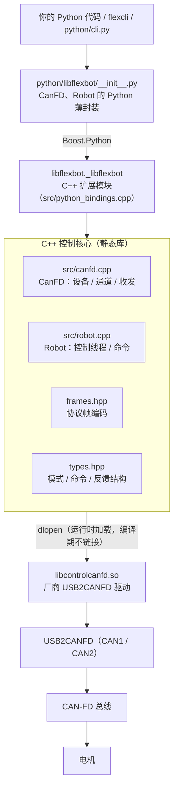

# libflexbot

> CAN-FD DM电机控制 SDK：**C++ 实时控制核心 + Python 接口**，支持 USB2CANFD 双通道、MIT / PV / PVT 三种控制模式与多电机 YAML 配置。

---

## 🧱 SDK 整体架构



| 分层 | 位置 | 职责 |
| --- | --- | --- |
| Python 层 | `python/libflexbot/__init__.py` | 面向用户的 API：模式名→寄存器值、配置路径解析、进程退出时兜底 `disable()` |
| 绑定层 | `src/python_bindings.cpp` | Boost.Python 封装 C++ 对象，`getj()` 直接产出 NumPy 数组 |
| 控制核心 | `src/robot.cpp`、`include/libflexbot/robot.hpp` | 控制线程、发送节奏、反馈解析、超时/错误/软限位处理、CPU 绑核 |
| 设备层 | `src/canfd.cpp`、`include/libflexbot/canfd.hpp` | 设备与通道管理、CAN/CAN-FD 收发、`dlopen` 厂商驱动 |
| 协议层 | `include/libflexbot/frames.hpp`、`types.hpp` | MIT / PV / PVT / 模式寄存器报文编码与数据结构 |
| 调试入口 | `python/libflexbot/cli.py`、`python/cli.py` | `flexcli` 交互式调试与 `flexzero` 置零命令行 |

设计要点：

- 控制线程跑在 C++ 里，1 kHz 的发送节奏不受 Python GIL 与解释器调度影响；Python 侧只做「下发目标」和「读取反馈」。
- 一个进程只打开一次设备（`CanFD`），可以用不同 `can_channel` 创建多个 `Robot`，互不干扰。
- 厂商驱动是运行时 `dlopen` 的：删掉 `libs/libcontrolcanfd.so` 依然能编译，只是运行期打不开设备。

---

## ✨ 特性

- 支持 **Ubuntu 20.04 / 22.04**
- 支持 **Python 3.8+**
- 支持 **USB2CANFD 双 CAN 通道**（`can_channel=0/1`）
- 支持 **MIT / PV / PVT 三种控制模式**，模式不匹配时只记录日志、不发送、不打断控制循环
- 支持 **多电机 YAML 配置**（夹爪本质上就是多配一个电机 id）
- 提供 **NumPy 反馈接口**（`getj()`）与 **CAN 反馈超时 / 电机错误 / 软限位保护**
- 提供 **控制线程绑核**（`enable(cpu=...)`）以降低调度抖动
- 提供 **`flexcli` 交互式调试命令行**
- 提供 **`flexzero` 一键置零命令行**（对 YAML 中所有电机发送 `set_zero`）

---

## 🧰 运行环境

- Ubuntu 20.04 / 22.04（依赖 Linux udev，暂不支持 Windows / macOS）
- Python 3.10
- 编译依赖：CMake ≥ 3.16、g++（C++17）、Boost.Python、Boost.NumPy、yaml-cpp、Python 开发头文件、NumPy 头文件

```bash
sudo apt install build-essential cmake libboost-python-dev libboost-numpy-dev \
     libyaml-cpp-dev python3-dev
```

> ⚠️ Boost.Python / Boost.NumPy 必须与你实际使用的 Python 版本 ABI 对应：Ubuntu 22.04 自带的 `libboost-python-dev` 对应系统的 python3.10。如果用 conda 或其它 Python 版本，需要自行准备对应版本的 Boost.Python / Boost.NumPy，否则 CMake 会报找不到 `Boost::python3XX`。

---

## 📦 安装方式

在项目根目录执行：

```bash
pip install -e .
```

`pip install` 会调用 CMake 编译 C++ 扩展（产物放在 `build-pip/`），并把厂商驱动 `libcontrolcanfd.so` 一并打包进 Python 包。安装完成后会多出两个命令行工具：

```bash
flexcli --help
flexzero --help
```

---

## 🔐 USB2CAN 权限设置

首次使用 USB2CAN 前，请配置设备权限（该设备为 USB `04d8:0053`）：

```bash
sudo cp libs/99-myusb.rules /etc/udev/rules.d/
sudo udevadm control --reload-rules
sudo udevadm trigger
```

执行完成后**重新拔插 USB 设备**或**重启系统**使配置生效。之后普通用户即可直接打开设备，不需要 `sudo`。

---

## 🔌 USB2CAN 连接说明

USB2CANFD 设备包含两个 CAN 通道，外壳上的丝印与代码中的 `can_channel` 对应关系为：

| 外壳丝印 | 代码中的 `can_channel` |
| --- | --- |
| **CAN1** | `0` |
| **CAN2** | `1` |

`can_channel` 是厂商驱动的**零基通道号**，`Robot(can_channel=...)` 直接使用它。

> 💡 使用时请确认硬件接入的通道编号与代码中的 `can_channel` 保持一致。接错通道的典型现象是：设备能正常打开，但使能后收不到任何反馈，约 200 ms 后 `last_error` 变为 `CAN feedback timeout`。

---

## 🚀 快速开始

```python
from libflexbot import CanFD, Robot

canfd = CanFD(device_index=0)                 # 只有一台 USB2CANFD 时使用 0
canfd.init(Abit=1_000_000, Bbit=5_000_000)    # 仲裁域 1 Mbps / 数据域 5 Mbps

robot = Robot(
    canfd,
    can_channel=1,                            # CAN2；如果接在 CAN1 则填 0
    freq=1000,                                # 控制循环频率 Hz
    config="config/motors.yaml",              # 必填，SDK 不会隐式选择配置文件
    soft_limit=False,                         # 台架调试建议先关闭
    mode="mit",                               # mit / pv / pvt
)

robot.enable(cpu=5)             # 启动控制线程，并绑定到 5 号 CPU 核心（可选）

robot.control_mit(1, kp=0.0, kd=0.0, p_des=0.0, v_des=0.0, t_ff=0.0)

state = robot.getj()            # 返回 dict[str, numpy.ndarray]
print(state["pos"], state["vel"], state["tau"], state["delay"])

robot.disable()                 # 停止控制线程并下发 disable 帧
```

`enable()` 会对 YAML 中的每台电机依次发送：**清除错误 → 设置模式寄存器 → 使能**，使能后等待一帧反馈确认（超时 200 ms）；确认无误后启动控制线程，按 `freq` 周期持续发送当前模式的命令帧。

> 💡 `cpu` 是零基核心编号，`enable()` 不传则线程不绑核。绑到一个空闲核心可以明显减少发送周期抖动。

---

## 🎛️ 控制模式

`Robot(..., mode=...)` 接受 `"mit"`、`"pv"`、`"pvt"`，对应协议寄存器值 1 / 2 / 4。模式会在 `enable()` 时写入电机，并决定控制线程每个周期发送哪种帧：

| 模式 | Python 接口 | 报文 ID | 数据域（8 字节） |
| --- | --- | --- | --- |
| `mit` | `control_mit(id, kp, kd, p_des, v_des, t_ff)` | `id + 0x000` | 16 位位置 + 12 位速度 + 12 位力矩 + 12 位 kp + 12 位 kd 打包格式 |
| `pv` | `control_pv(id, p_des, v_des)` | `id + 0x100` | float32 位置 + float32 限速 |
| `pvt` | `control_pvt(id, p_des, v_des, i_des)` | `id + 0x300` | float32 位置 + uint16 `v_des*100` + uint16 `i_des*10000` |

说明：

- 浮点字段为 IEEE-754 **小端** float32；PVT 的限速与电流标幺值是无符号 16 位小端，超过 10000 会被限制到 10000。因此 `v_des` 实际幅值为 0-100 rad/s，`i_des` 为 0-1.0。
- 模式寄存器报文发往 `0x7FF`，数据为 `[id, 0x00, 0x55, 0x0A]` 加 4 字节小端模式值。
- `control_*` 系列只负责**存入目标**，真正的帧由控制线程按 `freq` 周期发送，和 `control_mit()` 的行为一致。
- **模式不匹配**（例如 `mode="mit"` 时调用 `control_pv()`）不会发送任何帧，只在日志中记录 `ignore PV command ...` 并返回 `False`，**不会 disable 电机**——这不是致命错误。
- 其余被拒绝的情况（未知电机 id、非有限数值、超出关节软限位、MIT 数值超出电机量程）同样返回 `False`，原因写入 `last_error`。
- `pv` / `pvt` 模式下，如果 `enable()` 之前没有设置过目标，`enable()` 会自动用**当前反馈位置**作为目标、限速与电流限幅取 0，避免一上电就奔向 0 位；`enable()` 之前设置过的目标不会被覆盖。

三种模式的完整用法：

```python
# MIT：位置 + 速度 + 力矩前馈 + 刚度/阻尼
robot = Robot(canfd, can_channel=1, freq=1000, config="config/motors.yaml", mode="mit")
robot.enable(cpu=5)
robot.control_mit(1, kp=30.0, kd=1.0, p_des=0.0, v_des=0.0, t_ff=0.0)

# PV：位置 + 限速
robot = Robot(canfd, can_channel=1, freq=1000, config="config/motors.yaml", mode="pv")
robot.control_pv(1, p_des=0.5, v_des=1.0)      # rad, rad/s
robot.enable(cpu=5)

# PVT：位置 + 限速 + 电流标幺限幅
robot = Robot(canfd, can_channel=1, freq=1000, config="config/motors.yaml", mode="pvt")
robot.control_pvt(1, p_des=0.5, v_des=1.0, i_des=0.2)
robot.enable(cpu=5)
```

---

## 🔀 单个 USB2CAN 连接两条总线 / 两台机械臂

USB2CANFD 有两个通道，一个 `CanFD` 对象即可分别驱动两条总线：

```python
canfd = CanFD(device_index=0)
canfd.init(Abit=1_000_000, Bbit=5_000_000)

robot1 = Robot(canfd, can_channel=0, freq=1000, config="config/motors.yaml", mode="pvt")
robot2 = Robot(canfd, can_channel=1, freq=1000, config="config/motors.yaml", mode="pvt")

robot1.enable(cpu=5)
robot2.enable(cpu=6)
```

每个 `Robot` 有独立的控制线程、命令缓存与反馈缓存，互不影响。

> 📌 注意：同一台 USB2CANFD **同一时间只能被一个进程打开**。如果设备打不开并提示 `ZCAN_OpenDevice failed`，先确认没有其它程序（包括上一次没退干净的 `flexcli`）占用它。

---

## 🖥️ 交互式调试（flexcli）

`pip install` 会安装 `flexcli`，它读取 YAML、打开设备、使能电机，然后进入一个 Python 交互终端，等同于 `python -i python/cli.py`：

```bash
flexcli config/motors.yaml                 # 默认 mit 模式，CAN2，1000 Hz
flexcli config/motors.yaml --mode pvt --cpu 5
flexcli config/motors.yaml --no-enable     # 只打开设备不使能：getj() 读不到反馈，但可以 set_zero / 读写寄存器
```

```text
libflexbot interactive shell
  canfd  : device_index=0, initialized=True
  robot  : mode=mit, ids=[1], running=True
  exit() or Ctrl-D to quit; enabled motors are disabled on exit

>>> robot.getj()["pos"]
>>> robot.control_mit(1, kp=30.0, kd=1.0, p_des=0.0, v_des=0.0, t_ff=0.0)
>>> robot.disable()
```

常用参数：

| 参数 | 说明 |
| --- | --- |
| `--mode {mit,pv,pvt}` | 控制模式，默认 `mit` |
| `--channel` | CAN 通道（零基），默认 `1` |
| `--freq` | 控制循环频率，默认 `1000` |
| `--cpu` | 控制线程绑定的 CPU 核心，默认不绑 |
| `--device-index` / `--serial` | 多台设备时选择设备 |
| `--abit` / `--bbit` | 仲裁域 / 数据域波特率，默认 `1000000` / `5000000` |
| `--soft-limit` / `--no-soft-limit` | 是否启用 YAML 位置软限位，默认**关闭** |
| `--no-enable` | 只配置不使能；`set_zero` / 寄存器读写必须在这种状态下做 |

`flexcli --help` 可以查看全部参数。与 SDK 默认值不同，`flexcli` 默认**关闭软限位**，方便台架调试；需要限位保护时加 `--soft-limit`。

> ⚠️ **`set_zero()` / `read_timeout()` / `write_timeout()`（以及 `read_register()` / `write_register()` / `save_register()`）必须在控制线程停止时调用**，也就是 `flexcli --no-enable` 打开的状态，或者代码里从未调用 `enable()` / 已经 `disable()`。控制线程运行时电机在持续接收控制帧，这些单帧的置零、寄存器指令可能被忽略，或与反馈帧混淆。要做这些操作：先 `disable()`（或 `--no-enable` 打开），做完再 `enable()`。

---

## 🎯 电机置零（flexzero）

`pip install` 还会安装 `flexzero`：它对 YAML 里配置的**每一个电机**发送 `set_zero`。它复用 `flexcli` 的连接参数，但**不使能电机、也不进入交互终端**，正好满足上面「控制线程停止时读写电机」的要求。

```bash
flexzero config/motors.yaml
flexzero config/motors.yaml --channel 1 --device-index 0 --serial USBCANFD212606183346
```

```text
flexzero: sending set_zero to 1 motor(s): [1]
flexzero: j1 set_zero ok
flexzero: done
```

可用参数与 `flexcli` 的连接部分完全一致：`--device-index` / `--serial` / `--lib` / `--abit` / `--bbit` / `--channel`（`flexzero --help` 可查）。全部电机发送成功返回 `0`；任何一台失败返回 `1`，失败原因打印到 stderr，同时记录在该电机的 `robot.last_error` 里。

> ⚠️ `set_zero` 会把电机**当前**位置记为新的零点，直接改变之后 `getj()["pos"]` 的读数。执行前请确认机械臂确实停在你要当作零点的位置。

---

## ⚙️ 配置说明

默认配置文件为 `config/motors.yaml`，由用户自行维护，SDK 不会隐式选择：

```yaml
motor_types:
  dmj4310:
    pmax: 12.5        # 位置量程 ±rad（MIT 打包用）
    vmax: 30.0        # 速度量程 ±rad/s
    tmax: 10.0        # 力矩量程 ±N·m
  dmj4340:
    pmax: 12.5
    vmax: 10.0
    tmax: 28.0

robot_config:
  num_motors: 1
  motor_configs:
    - id: 1
      type: dmj4340
      limits:
        position:
          lower: -120.0   # 单位：度
          upper: 120.0
```

- `motor_types` 定义每类电机的量程，`motor_configs` 定义每条总线上的电机（`id` 必须与电机内部设置的 CAN ID 一致）。
- 关节位置限位单位为**度**，SDK 内部会换算成弧度再做软限位判断。
- 多关节机械臂 / 夹爪只是在 `motor_configs` 里多写几条；夹爪关节同样支持 `control_mit` / `control_pv` / `control_pvt` / `getj`。
- `num_motors` 必须与 `motor_configs` 条目数一致，否则加载配置时直接报错。

---

## 📚 API 速查

| 接口 | 说明 |
| --- | --- |
| `CanFD(device_index=0, serial=None, lib_path="")` | 打开设备；`serial` 用于多台设备时区分，`lib_path` 可指定自带的厂商驱动 |
| `canfd.init(Abit=1000000, Bbit=5000000)` | 初始化设备与波特率 |
| `canfd.close()` / `canfd.serial` / `canfd.device_index` / `canfd.initialized` | 关闭设备、读取设备信息 |
| `Robot(canfd, can_channel=1, freq=1000, config=None, soft_limit=True, mode="mit")` | 创建机器人；`config` 必填 |
| `robot.enable(cpu=None)` | 启动控制线程（可选绑核） |
| `robot.disable()` | 停止控制线程并下发 disable 帧 |
| `robot.control_mit(id, kp, kd, p_des, v_des, t_ff)` | MIT 模式命令 |
| `robot.control_pv(id, p_des, v_des)` | PV 模式命令 |
| `robot.control_pvt(id, p_des, v_des, i_des)` | PVT 模式命令 |
| `robot.set_zero(id)` | 把当前位置存为零点（**需控制线程停止**） |
| `robot.read_timeout(id)` | 读回电机的 CAN 反馈超时时间（毫秒，寄存器 `0x0933`；**需控制线程停止**） |
| `robot.write_timeout(id, timeout)` | 写入电机的 CAN 反馈超时时间（毫秒，寄存器 `0x0955`），成功返回 `True`（**需控制线程停止**） |
| `robot.read_register(id, register)` / `robot.write_register(id, register, value)` | 读写任意电机寄存器；`register` 为协议里的 16 位寄存器码（`0x33`+寄存器号 读、`0x55`+寄存器号 写，如读超时 `0x0933`、写超时 `0x0955`、写模式 `0x0A55`） |
| `robot.save_register(id, rid=0)` | 让电机把寄存器保存到 flash（`0xAA` 指令，帧为 `[id, 0x00, 0xAA, rid]`），等电机应答后返回 `True`；`rid=0` 保存全部寄存器，指定 `rid` 只保存该寄存器 |
| `robot.getj()` | 读取反馈：`pos`、`vel`、`tau`、`t_mos`、`t_rotor`、`timestamp`、`state`、`delay` |
| `robot.mode` / `robot.running` / `robot.last_error` / `robot.motor_ids` | 当前模式、控制线程状态、最近一次错误、YAML 中的电机 id 列表 |

`getj()` 返回的各字段都是与 `motor_ids` 顺序一致的 NumPy 数组；`delay` 是最近一帧反馈的年龄（毫秒），还没有收到反馈时为 `-1.0`。

> ⚠️ 上表里 `set_zero()` / `read_timeout()` / `write_timeout()` 以及整个寄存器读写族（`read_register()` / `write_register()` / `save_register()`）都要求**控制线程处于停止状态**：即用 `flexcli --no-enable` 打开，或先 `robot.disable()`。控制线程运行时这几种单帧指令可能被持续的控制帧淹没、被电机忽略，回帧也容易与反馈帧混淆。命令行下最省事的方式是用 `flexzero` 置零、用 `flexcli --no-enable` 读写寄存器。

---

## 📝 运行日志与错误处理

所有事件同时打印到 stdout 并追加写入日志文件，默认是当前工作目录下的 `logs/robot_events.txt`，可用环境变量覆盖：

```bash
export LIBFLEXBOT_LOG_DIR=/tmp/libflexbot-logs
```

控制线程会在以下情况**自动下发 disable 并退出循环**（`running` 变为 `False`，原因见 `last_error`）：

- 连续 200 ms 没有收到反馈（`CAN feedback timeout`）
- 电机上报错误状态：过压、欠压、过流、MOS 过温、线圈过温、通信丢失、过载
- 反馈位置超出 YAML 软限位（`soft_limit=True` 时）
- 命令帧发送失败

命令被拒绝（模式不匹配、参数越界等）**不会**停止控制线程，只记录日志并返回 `False`。

`write_timeout()` / `write_register()` 只发一帧写寄存器帧、不等应答，发送成功返回 `True`；未知电机 id 或发送失败返回 `False`，原因见 `last_error`。

`read_timeout()` / `read_register()` 是**请求—应答**式读取：向 `0x7FF` 发送读寄存器帧，等电机回帧。控制线程停止时由调用线程直接收帧；控制线程运行时由控制线程代收（寄存器回帧的 `data[1]` 为 `0x00` 且会回显寄存器号，据此与反馈帧区分）。读请求在 100 ms 窗口内每 20 ms 重发一次，所以偶尔丢一帧不会导致读失败；100 ms 内始终没有匹配的回帧会抛 `RuntimeError`，未知电机 id 同样抛错。

`save_register()` 向 `0x7FF` 发送保存帧（`[CANID_L, CANID_H, 0xAA, RID]`，标准帧下 `CANID_H` 为 `0x00`），并等待电机的应答帧（`data[2]` 为 `0xAA`，长度可能只有 4 字节，所以不校验寄存器号回显）。保存要写 flash、单次最长约 30 ms，因此超时窗口放宽到 200 ms、每 50 ms 重发一次；拿到应答返回 `True`，否则返回 `False` 并写入 `last_error`。

---

## ⚠️ 注意事项

- 程序退出时会自动 `disable()`（`atexit` + 析构），但**断电或控制丢失后机械臂会自由下坠**，请务必做好支撑与防护。
- 首次上电建议先用 `flexcli --no-enable` 确认设备能打开、配置能正常加载，再使能观察反馈。
- `set_zero`、`read_timeout`、`write_timeout` 等电机读写操作要在**控制线程停止**时做（`flexcli --no-enable`，或先 `disable()`）；置零前务必确认机械臂停在预期的零位，置零会立刻改变 `getj()["pos"]` 的读数。
- 台架调试建议 `soft_limit=False`；正式运行请打开软限位，并认真核对 YAML 中的关节限位是否与实际安装一致。
- PV / PVT 模式下电机持续跟随最后一个目标，调试时请把限速 `v_des` 与电流限幅 `i_des` 设小。

---

## ✅ 项目结构建议阅读顺序

1. 安装依赖并 `pip install -e .`
2. 配置 USB2CAN udev 权限（`libs/99-myusb.rules`）
3. 确认 USB2CAN 通道与代码中的 `can_channel` 一致：先用 `flexcli --no-enable` 确认设备能打开，再 `enable()` 确认能收到反馈（`getj()["delay"]` 不再是 `-1.0`）
4. 用 `config/motors.yaml` 初始化 `Robot`，跑通 `enable()` / `getj()` / `disable()`
5. 按需要切换 `mode`（`mit` / `pv` / `pvt`）并下发控制命令
6. 按上面的 API 速查表查接口
7. 需要新功能时再阅读 `include/libflexbot/` 与 `src/` 下的 C++ 实现

---

## 🙌 备注

如果你在使用过程中遇到问题，建议优先检查：

- USB2CAN 权限是否配置正确，设备是否被其它进程占用
- `can_channel` 是否与实际硬件接线一致
- `config` 是否指向正确的 YAML，`num_motors` 与电机 `id` 是否匹配
- 电机波特率与 `canfd.init(Abit=..., Bbit=...)` 是否一致
- 关节限位是否合理，调试阶段可先 `soft_limit=False`
- 机械臂是否固定在安全位置
